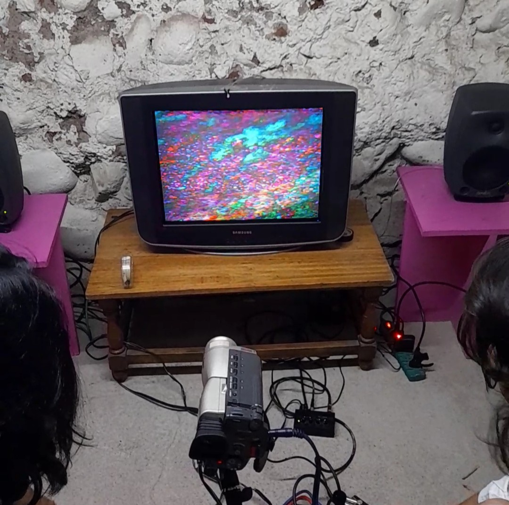
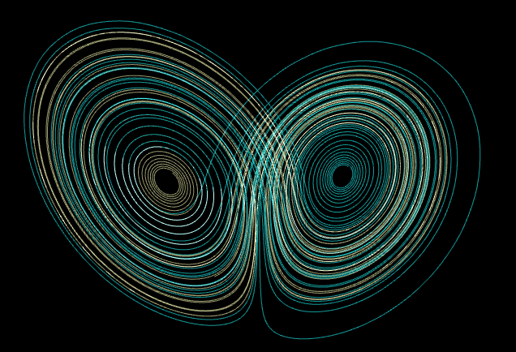

### Tips Clase anteproyectos 23.10.25

Lissajous figure ---> Osciloscopio
Módulo para reproducir mp3 ---> https://www.mercadolibre.cl/modulo-reproductor-mp3-con-lector-micro-sd-y-usb--arduino/up/MLCU30324120?matt_tool=16931662&utm_source=google_shopping&utm_medium=organic&pdp_filters=item_id%3AMLC440246708&from=gshop


# Ideas anteproyecto 


Herramientas ---> Processing, Pd, Video Feedback

Utilizar las visuales del feedback de video realizado en un televisor analógico para determinar el color de las letras en pantalla haciendo que processing detecte el color proyectado en video.
Referencia de las visuales que he logrado anteriormente con este método: https://www.youtube.com/watch?v=SNE7g9V4ggM

Referente: Jaime Cid - Colores minerales, una síntesis (obra audiovisual, 2025) ---> https://youtu.be/_Z9uiDLq_TU?si=aBgdQfzhamxI3q_b&t=2837. Lo que me interesa extraer de aquí es el método a través del cual se extrae la información de color de la imagen que luego es mapeada para controlar parámetros del sonido.

Podría hacer que los colores de cada letra (o cada palabra para hacerlo más fácil) varíen de forma independiente.

Mapear la info recogida desde el punto detector de colores en processing a info en Pure Data, me hace sentido usar un sonido de sintetizador tipo diente de sierra porque creo que es coherente con la estética de video analógico. Tal vez el parámetro obtenido desde processing pueda controlar la altura (pitch) de un acorde, y podría incorporar un secuenciador para generar cambios de acordes.


Podría usar la librería de video de processing para proyectar la imagen desde la cámara al televisor, y escriibir las letras sobre eso, las letras también serían parte del loop de feedback en ese caso.

# Imagen propuesta montaje:


Cámara Hi-8 ---> Processing in (Acá se incorporan las palabras) ----> Processing Out (De HDMI a Componente o Video Compuesto) ---> Tele CRT

# Processing
### Código de processing para extraer info de color a través de cámara actualizado 12.11.25


```processing
import processing.video.*;

Capture cam;

PVector pos;
PVector dir;
float velocidad = 1.5;

// Colores interpolados en RGB
float rActual = 255;
float gActual = 255;
float bActual = 255;

float rObjetivo = 255;
float gObjetivo = 255;
float bObjetivo = 255;

String[] versos = {
  "Todo está bien",
  "Todo está muy bien",
  "Todo está cada vez mejor"
};

void setup() {
  size(640, 480);
  // RGB por defecto (0–255), no necesitamos colorMode aquí
  textAlign(CENTER, CENTER);
  textSize(48);
  smooth();
  frameRate(60);

  // --- Inicializar cámara ---
  String[] cameras = Capture.list();
  if (cameras == null || cameras.length == 0) {
    println("No se encontró cámara :(");
    exit();
  }

  int indexCam = 3; // cámara por defecto: índice 3
  if (indexCam >= cameras.length) {
    println("No existe cameras[3], usando cameras[0] en su lugar.");
    indexCam = 0;
  }
  println("Usando cámara: " + cameras[indexCam]);
  cam = new Capture(this, cameras[indexCam]);
  cam.start();

  // --- Inicializar punto ---
  pos = new PVector(random(width), random(height));
  dir = PVector.random2D();
}

void draw() {
  // --- Actualizar cámara ---
  if (cam.available()) {
    cam.read();
  }

  // Mostrar imagen de cámara como fondo
  image(cam, 0, 0, width, height);

  // --- Movimiento del punto ---
  pos.add(PVector.mult(dir, velocidad));

  // Rebote en bordes
  if (pos.x < 0) {
    pos.x = 0;
    dir.x *= -1;
  }
  if (pos.x > width) {
    pos.x = width;
    dir.x *= -1;
  }
  if (pos.y < 0) {
    pos.y = 0;
    dir.y *= -1;
  }
  if (pos.y > height) {
    pos.y = height;
    dir.y *= -1;
  }

  // ---------------------------------
  //   PROMEDIO DE COLOR EN RGB
  //   (FIEL AL LUGAR BAJO EL PUNTO)
  // ---------------------------------

  int rango = 5; // radio del área (ajusta 3–10 según gusto)
  float rSum = 0;
  float gSum = 0;
  float bSum = 0;
  int count = 0;

  // Mapeamos la posición del punto (en el lienzo) a la resolución de la cámara
  float baseX = map(pos.x, 0, width, 0, cam.width - 1);
  float baseY = map(pos.y, 0, height, 0, cam.height - 1);

  for (int dx = -rango; dx <= rango; dx++) {
    for (int dy = -rango; dy <= rango; dy++) {
      int px = constrain(int(baseX) + dx, 0, cam.width - 1);
      int py = constrain(int(baseY) + dy, 0, cam.height - 1);
      color cTemp = cam.get(px, py); // leemos directamente de la cámara
      rSum += red(cTemp);
      gSum += green(cTemp);
      bSum += blue(cTemp);
      count++;
    }
  }

  if (count > 0) {
    rObjetivo = rSum / count;
    gObjetivo = gSum / count;
    bObjetivo = bSum / count;
  }

  // ---------------------------------
  //   INTERPOLACIÓN SUAVE EN RGB
  // ---------------------------------
  float k = 0.35; // sube este valor si quieres que siga el color aún más rápido

  rActual = lerp(rActual, rObjetivo, k);
  gActual = lerp(gActual, gObjetivo, k);
  bActual = lerp(bActual, bObjetivo, k);

  // Complemento RGB para el contorno
  float rComp = 255 - rActual;
  float gComp = 255 - gActual;
  float bComp = 255 - bActual;

  // --- Dibujar punto rojo (referencia visual) ---
  noStroke();
  fill(255, 0, 0);
  ellipse(pos.x, pos.y, 14, 14);

  // --- Dibujar texto con contorno complementario ---
  pushMatrix();
  translate(width/2, height/2 - 80);

  float borde = 4; // grosor del contorno
  float espacio = 70;

  for (int i = 0; i < versos.length; i++) {
    float y = i * espacio;

    // Contorno simulado (texto desplazado alrededor)
    fill(rComp, gComp, bComp);
    for (float dx = -borde; dx <= borde; dx += borde) {
      for (float dy = -borde; dy <= borde; dy += borde) {
        if (dx != 0 || dy != 0) {
          text(versos[i], dx, y + dy);
        }
      }
    }

    // Texto principal con el color promedio real
    fill(rActual, gActual, bActual);
    text(versos[i], 0, y);
  }

  popMatrix();
}

```
# La teoría del caos

Al remontarse a finales del siglo XVII luego de que Isaac Newton postulara su segunda ley y su teoría de gravitación universal, pareciera que todo se volvió predecible y que en teoría seríamos capaces de indicar con certeza el movimiento de planetas y cometas con siglos de anticipación.

Determinismo total ---> El futuro ya está fijado, sólo debemos esperar que se manifieste ---> Demonio de Laplace, un ser con el conocimiento del comportamiento de todo el universo que a través de esa información descifra el pasado y el futuro.

## EL Caos

Edward Lorenz ---> En 1963 ejecutó un código para predecir las condiciones atmosféricas a partir de 12 variables que la computadora imprimía graficando una curva. Cuando Lorenz corrió el código una segunda vez, fue por un café mientras la computadora procesaba los datos, y al volver notó que la segunda curva tendía a lo mismo que la primera en un comienzo, sin embargo con el paso del tiempo empezaba a divergir hasta comportarse de manera completamente distinta a al primer resultado. Las diferencias de las curvas se debían a que en su segunda ejecución, Lorenz había ingresado solo tres decimales en lugar de seis con los que trabajó originalmente. Este fenómeno se denominó "sensibilidad a las condiciones iniciales".



^^^Curvas conocidas como "atractores de Lorenz". Grafican la divergencia que pueden tener los comportamientos de cualquier cosa al introducir una diferencia en las condiciones iniciales por ínfima que esta sea.

