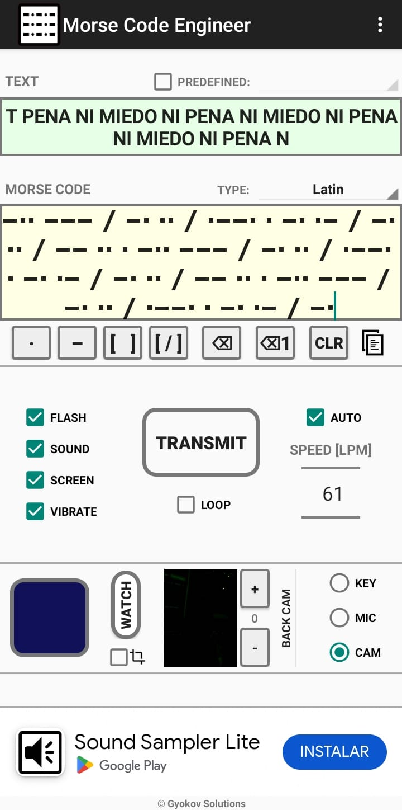

# Encargo 03
El encargo de esta semana consiste en traducir el texto elegido a código morse para comuniucarlo a través de un LED Usando Arduino.

En mi caso el texto es:

### NI PENA NI MIEDO

De Raúl Zurita, 1993

Para comprobar que el código comunicaba el mensaje correctamente, lo comprobé utilizando una App (funciona en Androis, en IOS no sé) llamada "Morse code Engineer". Que puede traducir código morse usando
la cámara del teléfono. Eso sí, debía acercar MUCHO la cámara al LED para que pudiera entender el mensaje.

 
