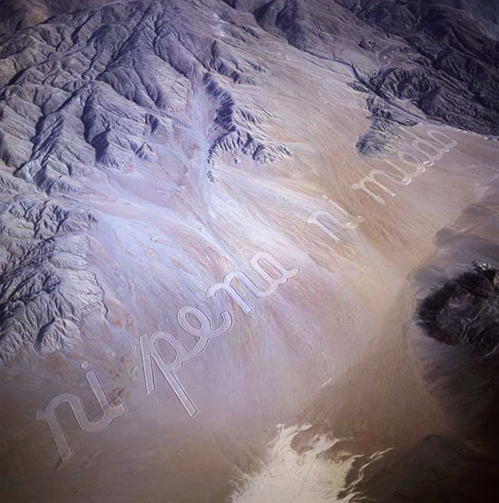
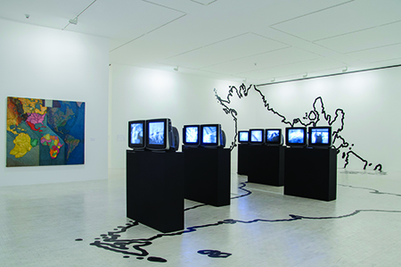
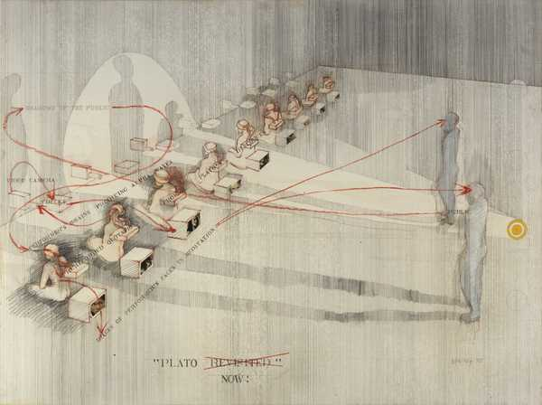

# Clase 01

## Aquí están los apuntes de la primera clase

## Artista que trabaje con palabras: Raúl Zurita
​
“Ni pena ni miedo” escribió Raúl Zurita en el desierto de Atacama en 1993.
De más de tres mil metros de longitud, la frase solo es visible desde el cielo.

## Artista Referente en cuanto a lo que queremos trabajar en el Curso: Juan Downey y el Video Analógico

### Algunos Obras que me llaman particularmente la atención son:

Video Trans-Americas: Instalación para 14 canales de video análogo donde se exponen registros fílmicos realizados por Downey entre 1973 y 1976.
Los registros muestran el viaje del artista a través del continente americano (Desde México hasta Chile), en donde convivió con diversos pueblos originarios 
de cada región, llegando a vivir como un integrante más de éstos. El objetivo de la obra consiste en formar una "arquitectura invisible", es decir, mostrar cómo vive cada pueblo a los demás pero también a ellos mismos, concibiendo a cada comunidad como partícipe de la obra y colaboradores.

Plato Now: El evento de 1973 contó con nueve participantes (incluido el artista Bill Viola y el curador David Ross) meditando de espaldas al público. Una fila de nueve monitores de vídeo colocados entre los meditadores y el público permitía a los espectadores ver los rostros de los artistas en un circuito cerrado de televisión mientras las sombras del público animaban la pared detrás.

