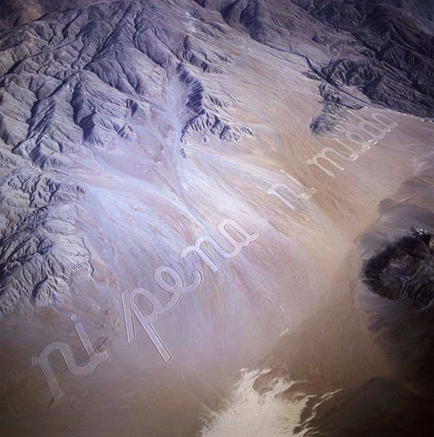
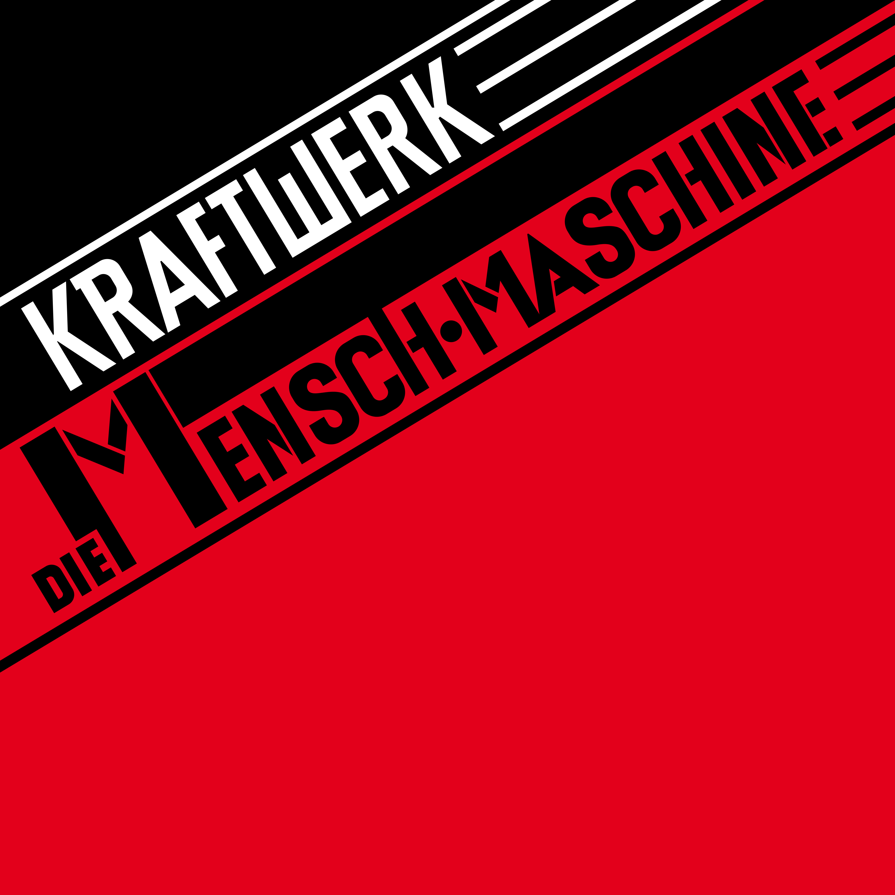
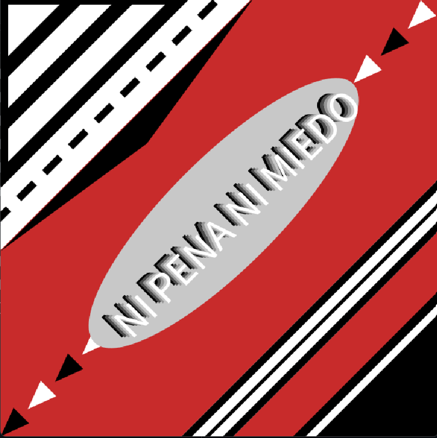

## El texto: Ni pena ni miedo, Raúl Zurita:



## Referentes Principales:

1) Portada de "The Man Machine" de Kraftwerk (1978)



2)¡Vence a los blancos con la cuña roja! - El Lissitzky (1919)


## Proceso, código y decisiones

A continuación explicaré decisiones en cuanto a cómo integré las influencias mencionadas anteriormente a la imagen que fabriqué en Processing: cuyo resultado dejo a continuación:



Como es evidente sobre todo por la paleta de colores, me basé mucho en la portada del disco de Kraftwerk aprovechando lo efectivo que resulta el uso de figuras geométricas simples como rectángulos, triángulos y líneas (que para efectos de lo que estamos haciendo en processing son solo rectángulos de baja altura). Obviamente intenté llevar la exploración un poco más allá incorporando más figuras y empleando herramientas como un ciclo for para dibujar los triangulos de la diagonal de una sola vez, y también un 'if' para condicionar el movimiento en diagonal de la elipse.

```ruby
  for (int i = 0; i < num2; i++) {
    // alternar color
    if (i % 2 == 0) fill(0);
    else fill(255);

    // dibujar triángulo isósceles apuntando hacia la diagonal
    triangle(0, 0, -base/2, -altura, base/2, -altura);

    // movernos hacia arriba (punta del triángulo) + separación
    translate(0, -(altura + espacio2));
  }
```

El fragmento de código anterior es el ciclo for que dibuja los triangulos de la diagonal alternando entre blanco y negro y haciendo que disminuyan su altura y se separen una determinada distancia para cada iteración. Le pedí a chatGPT que implementara esta función y lo hizo de esta manera. Hay que considerar que
nuestro lienzo ya estaba rotado en 45 grados, por eso aquello no fue especificado dentro del ciclo.

```ruby
  // Actualizamos posición
  x += velocidadX;
  y += velocidadY;

  // Rebote en bordes (aproximado, considerando margen)
  float margen = 100; // un margen mayor para la elipse
  if (x < margen || x > width - margen) velocidadX *= -1;
  if (y < margen || y > height - margen) velocidadY *= -1;
  //------------------ FIN TEXTO
}
```

Esta es la parte del código que se encarga de que la elpise con el texto se traslade de un lado a otro diagonalmente, también se lo pedí a chatGPT y esta fue la manera en el que lo implementó.

