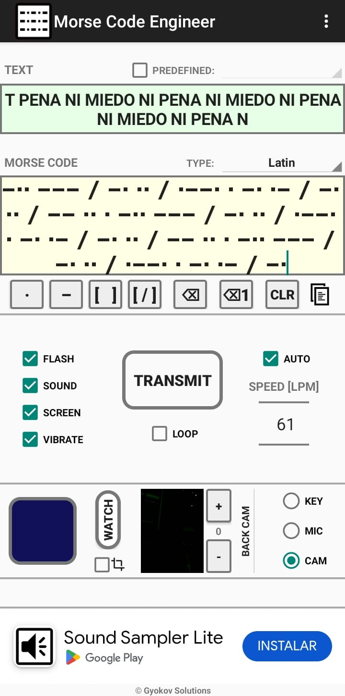

# Encargo 03
El encargo de esta semana consiste en traducir el texto elegido a código morse para comuniucarlo a través de un LED Usando Arduino.

En mi caso el texto es:

### NI PENA NI MIEDO

De Raúl Zurita, 1993

Para comprobar que el código comunicaba el mensaje correctamente, lo comprobé utilizando una App (funciona en Androis, en IOS no sé) llamada "Morse code Engineer". Que puede traducir código morse usando
la cámara del teléfono. Eso sí, debía acercar MUCHO la cámara al LED para que pudiera entender el mensaje.

 

A continuación se encuentra el código de Arduino dentro del cual detallo su funcionamiento. A grandes rasgos la forma en que lo implementé consiste en definir funciones para cada caracter usado: entonces definía la función e indicaba la combinación de puntos y rayas que utilizaba cada letra. Esto se ilustra en el código a continuación.

```ruby
//Lo primero que debo hacer para programar en aeduino es saber si mis pines son outputs o inputs
//El LED interno de arduino está conectado al Pin 13
//vamos a crear una variable para decir dónde está el led

int ledPin = 2; // ----> Elegí el pin 2 para usar un diodo led externo
int tiempoPunto = 100;
int separador = 100;
int tiempoRaya = 500;
int finCaracter = 500;
int espacio = 1000;

//cambié un poco los valores para que a la app le fuera un poco más fácil leer la alternancia entre puntos
//rayas y espacios

void setup() {

  //sintaxis --> (Numero de Pin,INPUT u OUTPUT)
  pinMode(ledPin, OUTPUT);
  //Serial.begin es la función que inicia la comunicación serial, es decir, mantiene el arduino conectado al computador
  //el númetro es la tasa de baudios
  Serial.begin(9600);
}
void loop() {

/*En esta sección, escribiremos y se ejecutará el texto "NI PENA NI MIEDO" a partir de funciones 'complejas', que
 representan caracteres en código morse. Estas a su vez están hechas a partir de funciones más simples que 
 constituyen las líneas y los puntos en los que se basa el código. 

 Además, luego de cada función colocamos un tiempo que sirva de espacio entre palabras*/

  ene();      //N
  ilatina();  //I
  delay(espacio); 

  pe();       //P
  e();        //E
  ene();      //N
  a();        //A
  delay(espacio);

  ene();      //N
  ilatina();  //I
  delay(espacio);

  eme();      //M
  ilatina();  //I
  e();        //E
  de();       //D
  o();        //O
  delay(espacio);
}

//----Acá definimos la función del punto y la raya y a partir de éstos pasaremos a 'componer' los caracteres----

void punto() {
  digitalWrite(ledPin, HIGH);
  //esperamos el punto encendido
  delay(tiempoPunto);  //con delay paralizamos el codigo por un tiempo en milisegundos
  //apagamos el led
  digitalWrite(ledPin, LOW);  //apagamos el Led
                              //esperamos el tiempo separador
  delay(separador);
}

void raya() {
  //encendemos la raya
  digitalWrite(ledPin, HIGH);
  //delay raya
  delay(tiempoRaya);
  //apagamos la raya
  digitalWrite(ledPin, LOW);
  delay(separador);
}

//----------------------------------------------------------------------------------------------

/*----------AHORA COMPONDREMOS LOS CARACTERES----------
El texto es "NI PENA NI MIEDO" (Raúl Zurita, 1993)
Entonces los caracteres a usar y sus respectivas traducciones son:

N -• 
I •• 
P •--•
E •
A •-
M --
D -••
O --- 
*/

//-----------Ahora definimos las funciones combinando puntos y rayas según corresponda.  
void ene() {  // N -----> RAYA PUNTO

  raya();
  punto();
  delay(finCaracter);
}

void ilatina() {  // I -----> PUNTO PUNTO

  punto();
  punto();
  delay(finCaracter);  
}

void pe() {  //P-----> PUNTO RAYA RAYA PUNTO
  punto();
  raya();
  raya();
  punto();
  delay(finCaracter);  
}

void a(){// A -----> PUNTO RAYA
  punto();
  raya();
  delay(finCaracter);  
}

void e() {  //E -----> PUNTO
  punto();
  delay(finCaracter);  
}

void eme() {  //M -----> RAYA RAYA
  raya();
  raya();
  delay(finCaracter);  
}

void de() {  //D -----> RAYA PUNTO PUNTO
  raya();
  punto();
  punto();
  delay(finCaracter);  
}

void o() {// -----> RAYA RAYA RAYA
  raya();
  raya();
  raya();
  delay(finCaracter);
}
```
